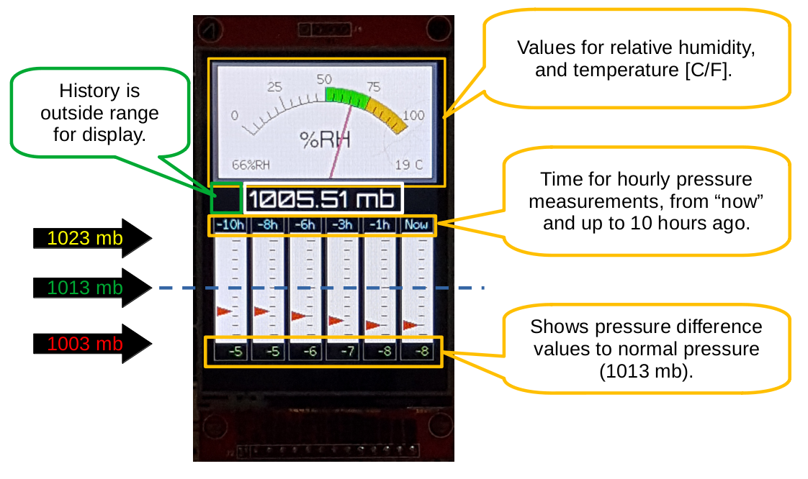

# ESP32 Nautical Barmometer Gold

Recent inventions of pressure sensors, precision is way better than old-fashioned mechanical nautical weather instruments. With Bosch's latest [BME680 sensor](./assets/Datasheet-BME680.pdf), you get pressure data, temperature- and humidity data, and optionally air quality.

I'm a sailor, and knowing the winds and weather is a good thing. I say it's gold because all other solutions are compared to it, the gold standard. With that, the `The Nautical Barometer Gold` project was born.

## Arduino code

This repository maintains the Arduino code for the project.

## Instructables

This [instructable](https://www.instructables.com/Your-Nautical-Barometer-Gold-for-Precise-Weather-F/) documents the project in detail.

## Hardware

As a minimum, you need the following primary material to get started.

* ESP32 development board
* BME680 breakout board
* `The Amazing ESP32 Adapter Board`

The ESP32 adapter board is documented [here](https://github.com/DebinixTeam/esp32-adapter-board-v1x.git). 

## Adapter board and ESP32 module compatibility

Find the tested ESP32 modules and pressure sensor in the nautical barometer project [here](./hw-compatibility-list.md).

## Credits

Two excellent Arduino libraries made this project possible.

* [TFT_eSPI](https://github.com/Bodmer/TFT_eSPI) by `Bodmer`
* [BME680](https://github.com/Zanduino/BME680) by `Zanshin Arduino`

